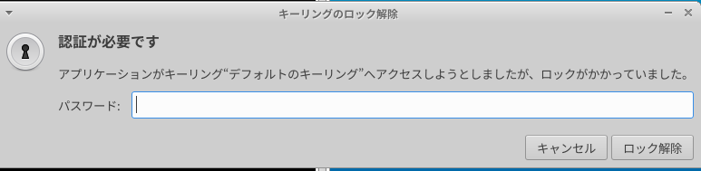
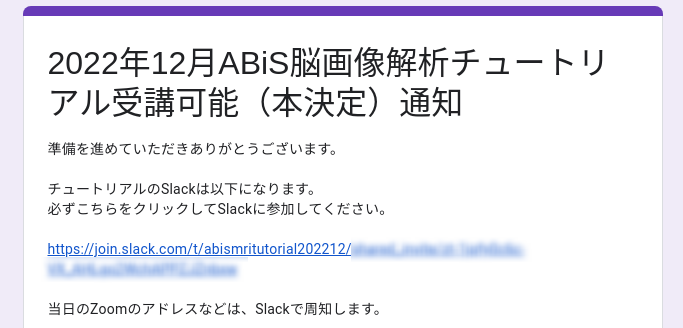

# ABiS脳画像解析チュートリアル22.12

ここは、2022年12月11日、および17-18日に開催予定である **『先端バイオイメージング支援プラットフォーム・ABiSチュートリアル』** の受講者を対象とした情報提供サイトです。新しい情報があれば、随時このサイトへ追加していきますので、定期的にアクセスするようにして下さい

## 目次

- [新着情報](#anchor0)
- [チュートリアルのスケジュール](#anchor1)
- [受講のための準備](#anchor2)
    - [パソコンのスペック](#anchor2_0)
    - 解析環境のセットアップ
        - [チュートリアル用Lin4Neuroのセットアップ](#anchor2_1)
        - [macOSネイティブ環境でのソフトウェアセットアップ](#anchor2_2)
    - [チュートリアル用テキスト・データ配布リポジトリのセットアップ](#anchor2_3)
    - [データの入手](#anchor2_4)
    - [受講のためのスクリプト実行](#anchor2_5)
- [問い合わせ](#anchor3)


<a id="anchor0"></a>

## 新着情報

- 2022.11.08 Lin4Neuroおよびmac native環境のセットアップについて記載しました
- 2022.10.28 タイムスケジュールについて記載しました
- 2022.10.09 チュートリアル用ウェブサイトを立ち上げました


<a id="anchor1"></a>

## チュートリアルのスケジュール (予定)

| 日程 | 内容
| :-- | :--
| 12月11日(日) | 脳画像解析入門（脳画像解析初心者は受講をお勧めします)
| 08:30 | Zoomオープン
| 09:00-09:20 | 開会、オリエンテーション
| 09:20-10:10 | 第1部(1) 画像ビューワー (筑波大・根本)
| 10:20-11:10 | 第1部(2) DICOM画像の理解 (根本)
| 11:20-12:10 | 第1部(3) DICOM画像のNIfTI画像への変換 (根本)
| 12:10-13:00 | 昼休み
| 13:00-14:00 | 第1部(4) 一般線形モデル (根本)
| 14:10-15:10 | 第1部(5) 脳画像統計 (佐賀大・川口)
| 15:20-16:10 | 第1部(6) シェルスクリプト (根本)
| 16:25-17:45 | 第1部(7) BIDS (根本)
| 17:45-18:00 | 質疑応答
| |
| 12月17日(土) | FreeSurferチュートリアル
| 08:30 | Zoomオープン
| 09:00-09:20 | 開会、オリエンテーション
| 09:20-10:10 | 第2部(1) FreeSurferの概要 / recon-all (筑波大・根本)
| 10:20-11:10 | 第2部(2) Freeview / ROI解析 (根本)
| 11:20-12:20 | 第2部(3) グループ解析 (根本)
| 12:20-13:10 | 昼休み
| 13:10-14:10 | 第2部(4) Slicerを用いたQC (岩手医大・山下)
| 14:20-15:20 | 第2部(5) Slicerを用いたトラブルシューティング (山下)
| 15:30-16:30 | 第2部(6) Freeviewを用いたトラブルシューティング (山下)
| 16:40-17:40 | 第2部(7) 他のソフトとの連携 (根本)
| 17:40-18:00 | 質疑応答
| |
| 12月18日(日) | 拡散MRIチュートリアル
| 08:30 | Zoomオープン
| 09:00-09:10 | 開会、オリエンテーション
| 09:10-10:10 | 第3部(1) DWIの前処理 (慶応大学病院・上田)
| 10:20-11:20 | 第3部(2) TBSS (Non-FA Analysisも含む) (上田)
| 11:30-12:30 | 第3部(3) 脳器質的疾患のTBSS (上田)
| 12:30-13:20 | 昼休み
| 13:20-17:20 | 第4部: TBSS解析後の結果表示と追加解析
| 13:30-14:30 | 第4部(1) FSLeyesのアトラスツール (順天堂大・下地)
| 14:40-15:40 | 第4部(2) bashの活用 (下地)
| 15:50-16:50 | 第4部(3) all_FA_skeletonisedの活用 (下地)
| 17:00-18:00 | 第4部(4) 関心領域の作成 (下地)

<a id="anchor2"></a>

## 受講のための準備

- チュートリアルはご自身の環境で受講していただきます。そのために事前準備が必須となっております。講師と同じ環境で解析をするため、仮想化ソフト VirtualBox を使用し、そのうえで、脳画像解析に特化したLinux, Lin4Neuro を使いながらチュートリアルは進めていきます。(なお、Apple M1/M2 CPUをお使いの方は VirtualBox が正式に対応していないので、個別にソフトウェアをセットアップしていただくことになります。) 事前準備を済ませたうえで、受講のためのスクリプトを実行し、それが正しい結果を出した方にZoomおよびSlackのアドレスをお示しします。早めにご準備のほどよろしくお願いします。なお、今回お配りするLin4Neuroは2022年12月および2023年1月用に最適化されています。2022年1月以前のLin4Neuroにはソフトが入っていないものがいくつもありますので、改めてセットアップをお願いします

- 流れは以下になります
    - 解析環境のセットアップ
    - チュートリアルのテキスト・データ配布リポジトリのセットアップ
    - チュートリアルのデータ入手
    - 受講のためのスクリプト実行
    - 本登録

<a id="anchor2_0"></a>

### パソコンのスペック

- チュートリアルでは、受講者にご自身でPCを準備して頂き、実際に操作しながらコマンドラインについて学んでいきます。PCのスペックについては、以下の **推奨条件** を参考にして下さい

    - OS: Windows 10/11 64bit版 または macOS 11.x (Big Sur) - 12.x (Monterey)
    - CPU: Intel Core i7/i9、Intel Core i5（クロック周波数2.0GHz以上）、または AMD Ryzen 5以上の性能を有するもの 
        - **注意: 現在、Apple M1/M2はVirtualBoxでLin4Neuroを動作できないため、チュートリアルで使用するソフトは個別にインストールしていただく必要があります。完全なサポートができないことをご承知おきください**
    - メモリ：8GB以上 (可能ならば16GB以上を推奨します)
    - ハードディスク：250GB以上の空き容量 (外付けハードディスクも可)
    - 2ボタン以上のUSBマウス (必須ではありませんが、持っていると便利です)
    - 2画面のディスプレイ (自身の作業用とZoomの画面をうつすために2画面を推奨します。2画面が準備できない方は、Zoomの画面をうつすためだけのPCやタブレットを準備してください)

### 解析環境のセットアップ

<a id="anchor2_1"></a>

#### チュートリアル用Lin4Neuroのセットアップ (所要時間約2-3時間) 

- チュートリアル用Lin4Neuroのセットアップは[こちらのインストラクション](./setup_l4n_2022.md){:target="_blank"} に従って準備を進めてください。

<a id="anchor2_2"></a>
#### macOS ネイティブ環境でのソフトウェアセットアップ (所要時間約3-4時間)

- Apple M1/M2 の方は、各自でソフトウェアをインストールしていただく必要があります。また、Intel Mac をお使いの方で、ネイティブ環境で構築したい場合もあるかと思います。その場合は[こちらのインストラクション](./setup_macnative_2022.md){:target="_blank"} に従って準備を進めてください。

<a id="anchor2_3"></a>
### チュートリアル用テキスト・データ配布リポジトリのセットアップ (所要時間約3分) 

- チュートリアルで使用するテキストは、GitLabというデータ共有サービスを通して配布します。ここで配布されるものは、チュートリアルの1週間前まで更新される可能性がありますので、こまめに（特に参加直前に）アップデートするようにして下さい

- macOS ネイティブ環境で参加される方は、以下のコマンドにより、ホームディレクトリの下に abis フォルダを作成します。このようにすることで、iCloud の管理外になりますので、iCloudが問題になることを防ぐことができます

   ```
   mkdir ~/abis
   ```

1. 初めてセットアップする時: ターミナルから以下を実行してください。なお、ターミナルは、Lin4Neuro では左下のスタートアイコンの隣にあるアイコンから起動できます。macOSの方はユーティリティからターミナルを実行してくだい

    ```
    cd ~/abis
    受講者仮決定メールに記されているコマンドをここにタイプします
    (セキュリティの都合でここには記しません)
    ```

2. 更新する時: ターミナルから以下を実行してください

    ```
    cd ~/abis/abis-202212
    git pull
    ```

- こうすると、`~/abis/abis-202212` の下に `beginner`, `dti`, `dti2`, `freesurfer`, `textbook` のフォルダが生成されます

<a id="anchor2_4"></a>
### データの入手 (所要時間約1時間)

- チュートリアルに使うデータは大きいため、GitLabではなく、別にダウンロードしていただきます

- 上記のテキストの入手を行った後、ターミナルから以下をタイプしてください

    ```
    cd ~/abis/abis-202212
    ./get_data.sh
    ```

- データが10GB程度ありますので、約1時間程度見込んでください。環境によってはさらに時間がかかってしまうことがあるため、電源を必ずつなぎ、パソコンがスリープしないようにしてください

- こうすると、`abis-202212` の `beginner`, `dti`, `dti2`, `freesurfer` の中にそれぞれデータが準備されます

<a id="anchor2_5"></a>
### 受講のためのスクリプト実行 (所要時間約45分) 

- 環境がすべて整っているかを確認するために、確認スクリプトを実行していただきます

- ターミナルから以下をタイプしてください

    ```
    cd ~/abis/abis-202212
    ./abis_test.sh
    ```

- そうすると以下が表示されます

    ```
    FreeSurfer, FSL, MRtrix3 の動作確認を行います
    はじめて実行する場合は、45分程度かかります
    最後に出力される数値を報告してください
    yesまたはnoを入力してください
    ```

- `yes` をタイプすると、FreeSurferのコマンド 及び MRtrix と FSL の トラクトグラ
フィー作成のための準備コマンド が走りはじめます

- コマンドの実行が完了すると、ターミナルに以下が表示されます。

    ```
    ------------------------------------------------
    以下の数値を報告してください
    XXX
    ------------------------------------------------
    ```

- さらに、続いて以下が表示されます

    ```
  　数値報告用のフォームを開いてよろしいですか? 
  　yesまたはnoを入力してください
    ```

- `yes` をタイプすると、webブラウザー が立ち上がり、数値入力用の Googleフォーム が開きます。なお、下図のように「キーリングのロック解除」画面が出たら、パスワードに lin4neuro と入力してください

    

- Googleフォーム に必要項目をご入力ください
    
- 入力した数値が正しい場合には、その次の画面に受講者専用のSlackのリンクが表示されます。こちらからSlackに登録してください

    

- もし、解析が途中で失敗した場合は、以下が表示されます

    ```
    なんらかの問題が起こっているようです
    問い合わせフォームからお問い合わせください
    ```

- 問い合わせフォームが立ち上がりますので、そこからトラブルシューティングを依頼してください

<a id="anchor3"></a>
## 問い合わせ

- 準備がうまくいかない時のために、問い合わせフォームを準備しています。こちらからご質問ください。数日以内に担当者から返信させていただきます

- [問い合わせフォーム](https://forms.gle/NNCjrKn4uQJeYKdg6){:target="_blank"} 


