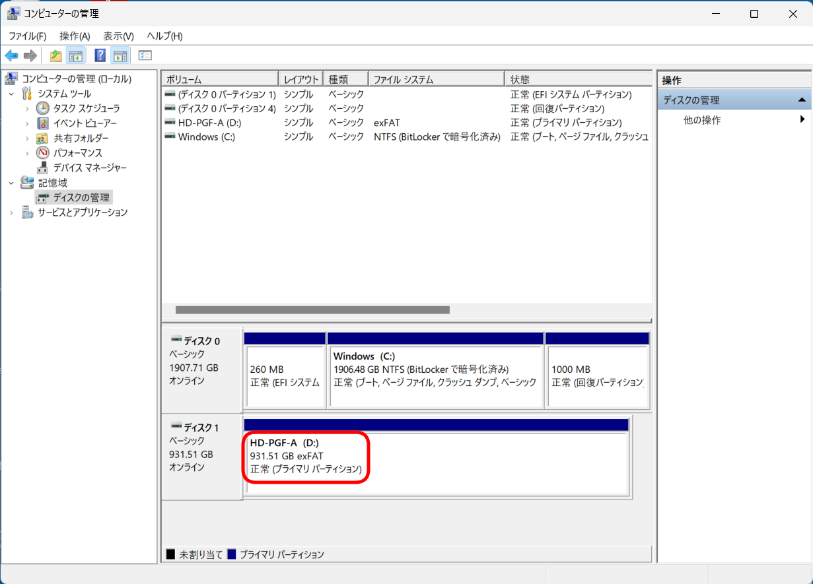
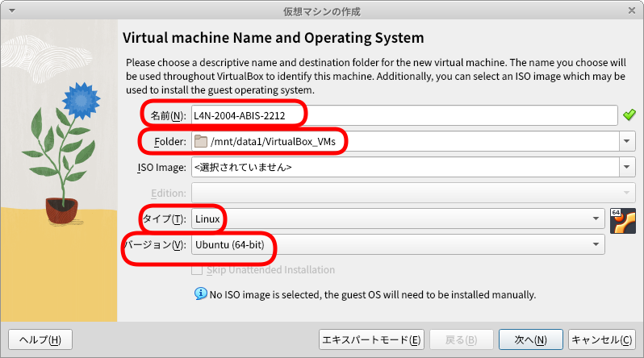
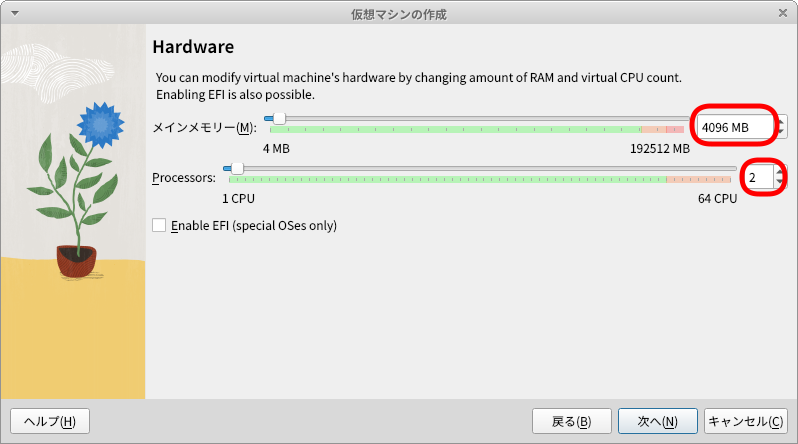
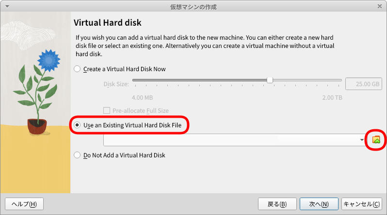
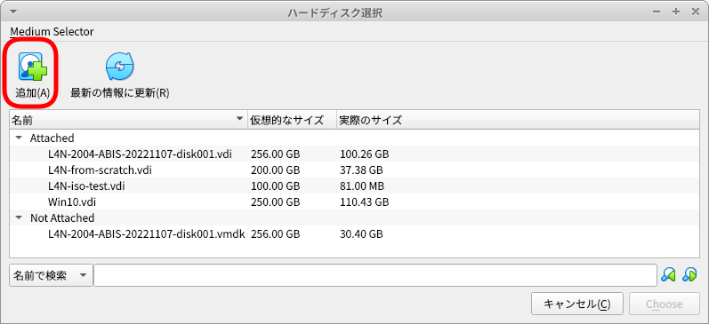
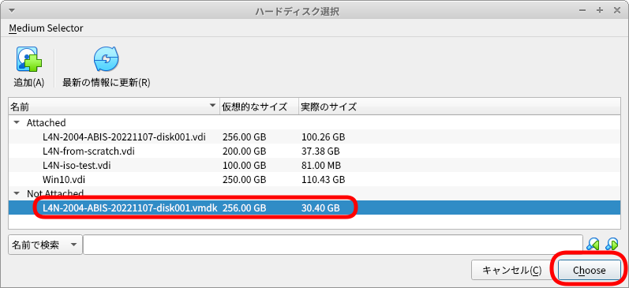
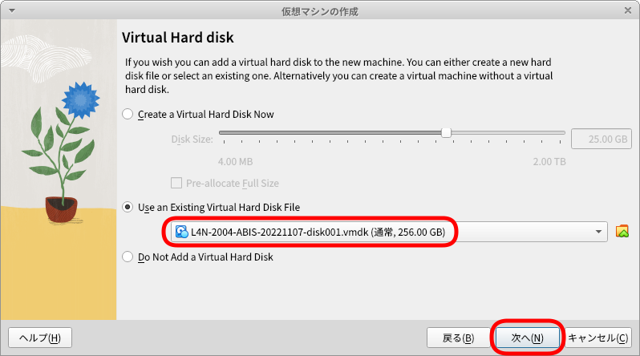
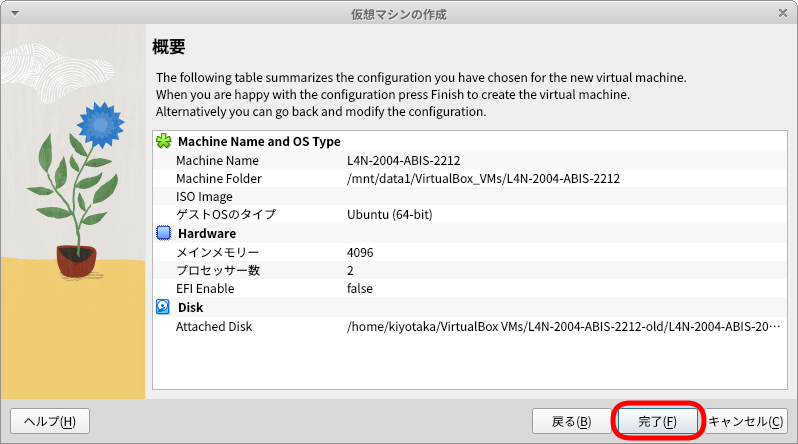
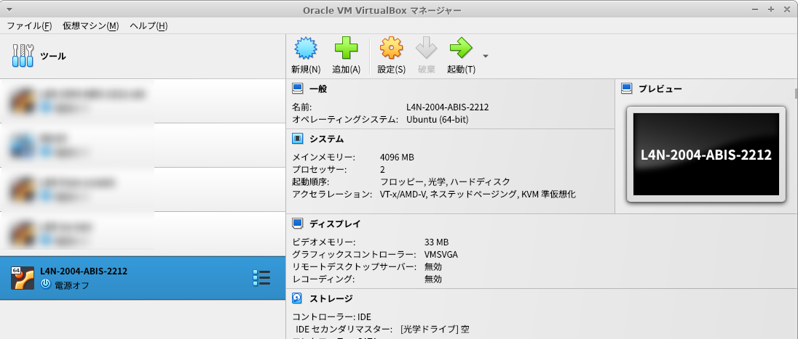

# Lin4Neuro仮想マシンが中断(Aborted)などした場合の対応

Lin4Neuroを一度インポートした後、「中断」となったような場合、以下の方法を試していただけたらと思います。

## 準備

- VirtualBox 7.0.2 以降はインストールされている前提でいきます

- エラーとなったLin4Neuroはそのままにしておいてください

- Windows の方は、外付けHDD/SDD のフォーマット形式が NTFS か exFAT であることを確認してください

    - Windowsのメニューの検索から、「コンピューターの管理」と調べて、コンピューターの管理を出し、外付けディスクが NTFS か exFAT であることを確認してください。FAT32 だとダメです。

    

- 本例では、Dドライブに vm というフォルダを作成し、そこで作業することにします

## 仮想ハードディスクの複製

- 今回のポイントは、仮想ハードディスクの複製を作成し、それを使用して、新しい仮想マシンを作成することです

- まず、VirtualBoxのメイン画面から「ツール」をクリックします。そこで、"L4N-2004-ABIS-20221107-disk001.vdi" を選択してから、「コピー」をクリックします

    

- ハードディスクの形式を聞かれますので、デフォルトの VDI を選択して、「次へ」をクリックします

    

- 物理ハードディスクにあるストレージは、何も選択せずに「次へ」をクリックします

    

- 新しい仮想ハードディスクファイルの名前と保存場所を決めます。右側のフォルダアイコンを選択して、保存場所を選んでください。ここでは、D:\vm の中に、L4N-2004-ABIS-20221107-disk001_copy.vdi としました

    

- コピーにしばらく時間がかかりますが、コピーが終わると、ツールの画面にコピーされた仮想ハードディスクが表示されます

    

## 新規仮想マシンの作成

- 今作成したハードディスクを用いて新規仮想マシンを作成します。VirtualBoxのメインメニューで、既にある仮想マシンの場所をクリックしたうえで、「新規」をクリックします

    

- 仮想マシンの名前とOSを聞かれます。シンプルに名前を "L4N" とし、フォルダを D:\vm とします。そうすると、D:\vm\L4N が自動で作成されます。タイプはLinux,バージョンはUbuntu(64-bit)を選択してください

    

- メモリとCPUを決めます。ここでは例としてメモリ8GB (8192MB), CPUは 2CPU にしています

    

- ハードディスクを選択します。ここで、"Use an Existing Virtual Hard Disk File" を選択し、先程、複製した仮想ハードディスクを選択します

    

- 設定の一覧が表示されますので、「完了」をクリックします

    

これにより、仮想マシンが新たに作成されますので、そちらを使っていただけたらと思います

- 以下を設定します
    - 名前: L4N-2004-ABIS-2212 としてください
    - Folder: 自分がインストールしたいフォルダ (250GB以上空き容量があるところ) を指定してください
    - タイプ: Linux を選んでください
    - バージョン: Ubuntu (64-bit) を選択してください
    - ここまで選んだら「次へ」をクリックします

    

- メモリは 4096MB、CPUは2を設定して「次へ」をクリックしてください(任意ですが、まずはこれで)

    

- Virtual Hard disk の画面では、"Use an Existing Virtual Hard Disk File" を選び、その右側のフォルダアイコンをクリックしてください

    

- ハードディスク選択の画面で、「追加」をクリックし、先程展開した L4N-2004-ABIS-20221107-disk001.vmdk を選びます

    

- そうすると、Not attached のところにL4N-2004-... があらわれるので、それを選択して"Choose" をクリックしてください

    

- 今選択したハードディスクが表示されていることを確認してから、次へをクリックします

    

- これで「完了」を押すと完了です

    

- 選択して起動するかどうかを確認してください

    

