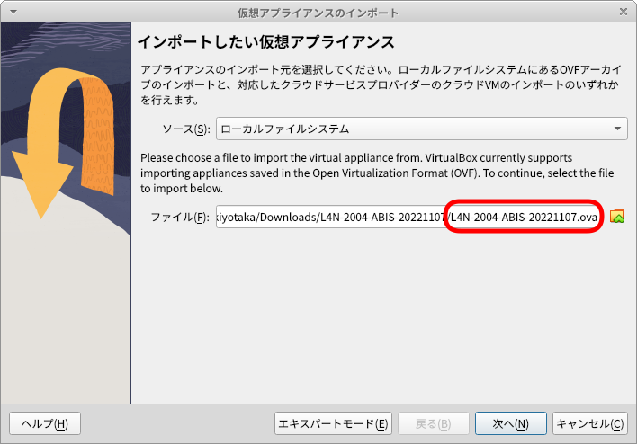
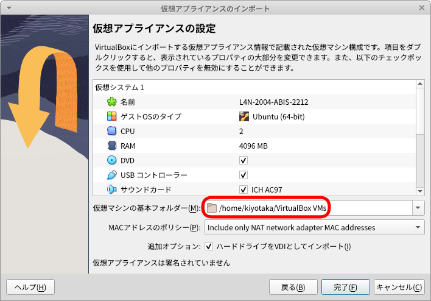
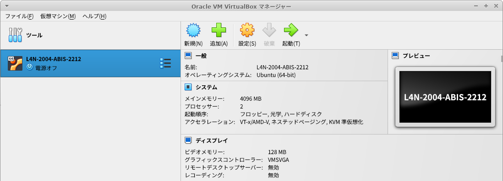
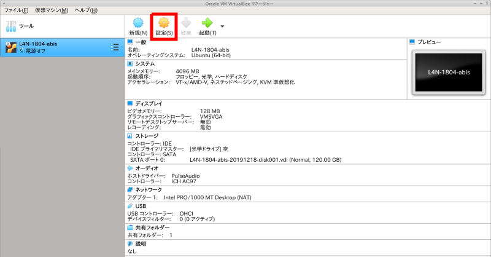

# ABiS脳画像解析チュートリアル用Lin4Neuroのセットアップ

## 目次

- [はじめに](#anchor0)
- [事前準備](#anchor1)
    - [A. チュートリアル用Lin4Neuro仮想アプライアンスのダウンロード (2-3時間)](#anchorA)
    - [B. VirtualBox 7.0.2以降 のインストール (10分)](#anchorB)
    - [C. Lin4Neuro仮想アプライアンスのインポート (15分)](#anchorC)
    - [D. 仮想マシンの設定 (5分)](#anchorD)
    - [E. Lin4Neuroの起動と設定 (10分)](#anchorE)
    - [F. チュートリアルテキストの入手 (3分)](#anchorF)
    - [G. データの入手 (30-60分)](#anchorG)
    - [H. 受講のためのスクリプトを実行 (約15分)](#anchorH)
    - [参考. 仮想マシンの削除](#anchorI)
- [問い合わせ](#anchor2)
- [トラブルシューティング](#anchor3)

<a id="anchor0"></a>

## はじめに

- **チュートリアルの準備には、約4-5時間必要となります。時間に十分に余裕をもって準備をされてください。なお、準備が終わった方にのみ当日のZoomのリンクおよびSlackのリンクが表示されますので、必ず準備を行ってください。準備なしの参加はできません**

- 今回は完全オンライン開催ですが、ここに示すVirtualBox＋Lin4Neuroの組み合わせで参加することで、過去のチュートリアルと同様にチューターや講師による手厚いサポートが受けることができます。脳画像解析の初心者の方々は記載されている通りに事前準備を行いチュートリアルへ参加することを強く推奨します

- 自分自身で基礎的なトラブルシューティングが行える脳画像解析の経験が豊富な中級者以上の方々は、受講者専用サイトに記載されている以外の解析環境（例えば受講者自身が構築した解析環境など）でもチュートリアルに参加可能ですが、チューターによるサポートの対象外とさせて頂きますので、ご理解、ご協力の程、よろしくお願いします

- チュートリアルに十分な環境で参加していただくために、受講環境を整えたうえで、スクリプトを実行してその値が正しい場合に限り当日のZoomアドレスをお送りします。**2022年12月4日までに**必ず以下の手順を実行してください。テストスクリプトを実行できた方が受講できます

- 準備ができた方には受講者専用のSlackに招待します。そちらでさらに情報がありますので、ここの準備が終わった後は、Slackをご確認ください。

<a id="anchor1"></a>

## 事前準備

- Lin4Neuroはチュートリアルにあわせてアップデートされています。**過去のLin4Neuroは使用できませんのでご注意ください**

- ソフトウェアとデータのダウンロードで合計 40GB程度ダウンロードします。Pocket Wi-Fiなどでは確実にパケ死しますので、職場やご自宅のLAN環境から作業してください

<a id="anchorA"></a>

### A. チュートリアル用Lin4Neuro仮想アプライアンスのダウンロード (所要時間約2-3時間)

- 分散ダウンロード(推奨): Lin4Neuroは30GBありますので、分散ダウンロードできるプログラムを準備してあります。自身の環境にあわせて以下の対処を行ってください。Lin4Neuroを30のファイルに分割してダウンロードします。ネットワークの環境にもよりますが、1ファイルあたり3〜5分程度かかりますので、ダウンロード終了に約2〜3時間かかるとお考えください。なお、2022年12月と2023年1月のチュートリアルで使用するLin4Neuroは同じです。

    - Windows10

        - [Windows用ダウンローダー](https://github.com/kytk/abis-web-202212/releases/download/v20221026/l4n_win.zip)をダウンロードします

        - l4n_win.zip を展開します

        - l4n_win フォルダの中にある `get_L4N_win.bat` をダブルクリックします

        - 「WindowsによってPCが保護されました」という画面が出ますので、「詳細情報」をクリックします

        - 右下に「実行」ボタンが出ますので、実行をクリックします

        - コマンドプロンプトの画面が立ち上がり、ダウンロードが始まります

        - ダウンロードが完了すると、L4N-2204-ABIS-20221026 フォルダの中に L4N-2204-ABIS-20221026.ova というファイルが生成されます

        

        

        
 
    - macOS

        - [macOS用ダウンローダー](https://github.com/kytk/abis-web-202212/releases/download/v20221026/l4n_mac.zip)をダウンロードします

        - ターミナルを起動します

	- ターミナルに以下をタイプします。

        ```
        cd ~/Downloads
        cd l4n_mac
        bash get_L4N.sh
        ```


        - そうすると、ターミナルが起動し、ダウンロードがはじまります

        - ダウンロードが完了すると、L4N-2204-ABIS-20221026 フォルダの中に L4N-2204-ABIS-20221026.ova というファイルが生成されます

        
 

- 一括ダウンロード: 十分にネットワークが安定している方は、以下からダウンロードしてください。30GBありますのでダウンロードには2〜3時間かかります。ネットワークが細い方は、上の分割ダウンロードを選択してください

    - [L4N-2204-ABIS-20221026.ovaのダウンロード](http://www.nemotos.net/l4n-abis/L4N-2204-ABIS-20221026.ova){:target="_blank"}

    - L4N-2204-ABIS-20221026.ovaのmd5値は、`ded1b4e7852083459b7514db11545aad` になります。ファイルサイズの検証にお使いください

        - macOSならば、`openssl md5 L4N-2204-ABIS-20221026.ova` で確認できます
        - Windowsならば、PowerShellから、`Get-FileHash -Algorithm md5 L4N-2204-ABIS-20221026.ova` で確認できます

<a id="anchorB"></a>

### B. VirtualBox 7.0.2以降 のインストール (所要時間約10分)

チュートリアルでは、**<span style="color: red; ">VirtualBox 7.0.2以降</span>**の上で Lin4Neuro を動作させます。最新版の Lin4Neuro は、VirtualBox 7.0.2 で最適化されているため、前のバージョンのVirtualBoxを使用の方は**必ず7.0.2以降にアップグレードしてください。

- [VirtualBoxのサイト](https://www.virtualbox.org/wiki/Downloads){:target="_blank"} から、ご自身のOSにあったVirtualBoxのインストーラーをダウンロードします

- ダウンロードしたインストーラーを用いてVirtualBox 7.0.2 をインストールします

- インストール後、VirtualBoxを起動します

    
    
<a id="anchorC"></a>

### C. Lin4Neuro仮想アプライアンスのインポート (所要時間約15分) 

- ダウンロードした仮想アプライアンス (L4N-2204-ABIS-20221026.ova) を用いて仮想マシンをインポートします

- VirtualBoxのメニューから **ファイル** → **仮想アプライアンスのインポート** を選択します

- ファイルに、ダウンロードした **L4N-2204-ABIS-20221026.ova** を指定し、 **<kbd>次へ</kbd>** をクリックします

    

- 設定画面が出ます。ひとつだけ気をつけていただきたいのが、 **Machine Base Folder** です。このフォルダの下に仮想マシンがインストールされます。必ず、**<span style="color: red; ">100GB以上あいているところを指定してください</span>**(容量が十分にある場合は、デフォルトのままでかまいません)。外部ハードディスクを指定することもできます。SDカードは、速度が異常に遅く実用性に耐えられませんので、使わないでください

- 設定を確認したうえで、 **インポート** をクリックしてください
- インポートには10−15分程度かかります。辛抱強くお待ちください

    

- インポートが終了すると、VirtualBoxのメイン画面に、 **L4N-2204-ABIS** が表示されます

    

<a id="anchorD"></a>

### D. 仮想マシンの設定 (所要時間約5分) 

#### 1. 共有フォルダの設定

- 30GB以上あいているところに、Macの方はFinderから、Windowsの方はエクスプローラーから、 **share** というフォルダを作成します。すべて小文字で作成してください

- あとで確認するため、作成した share フォルダに、何か適当なファイルを入れておいてください

- VirtualBoxのメイン画面で、L4N-2204-ABISをクリックし、選択してから、 **設定** をクリックします

    

- 設定画面の左側のペインで **共有フォルダー** をクリックしたうえで、画面右側の共有フォルダを追加するアイコンをクリックします

    

- **フォルダーのパス** の右側の▼から、**その他...** を選択し、先程作成した **share** フォルダを選択します

- フォルダー名が **share** になっていることを確認します

- **読み込み専用** と **自動マウント** は**チェックが入っていない**ことを確認してください

- このうえで、 **<kbd>OK</kbd>** をクリックします

    

#### 2. メモリの設定

- **CONNはメモリをかなり消費します。また、CPUも消費します。そのため、ホストPCにメインメモリが16GB以上ある場合、メモリはデフォルトの4GBでなく、できたら8GBを割り当てることを推奨します。**

- 設定画面の上から2番め、**システム** をクリックします

- メインメモリーがデフォルトでは、4096MB、すなわち4GBとなっています。これを、ご自身のPCのメモリに余裕があるならば、増やしてください。Windows/macOSが安定して動くためには、システムに最低4GB(できれば8GB)を与えることは必要です。そのうえで、Lin4Neuroのメモリを増やすことで、動きが改善します。できれば、デスクトップマシンで16GBのメモリを搭載しているならば、仮想マシンに8GB (8192MB)と設定してあげてください。1GB=1024MBです

    

- これで、設定は終了です

<a id="anchorE"></a>

### E. Lin4Neuroの起動と設定 (所要時間約10分)

- VirtualBoxのメイン画面から、 **L4N-2204-ABIS** を選択したうえで、 **起動** をクリックします

    


- 下図のような画面になります。Enter/return を押すかそのまま待てば自動で起動します

    

- ログイン画面が立ち上がります。パスワードは **lin4neuro** です。すべて小文字です

    

- アップデートの画面に関しては、"Install Now" を選択してください

    

- パスワードを聞かれます。小文字で **lin4neuro** と入力してください

    


#### 1. キーボード設定の確認 (**英語キーボードの方のみ**)

- 配布しているLin4Neuroの仮想マシンは日本語キーボードで設定されています。英語キーボードにするには、以下の作業を行ってください

- メニューから "設定" -> "Fcitx設定" を選択します

    

- 画面下の矢印を使って、"キーボード - 英語(US)" が一番来るようにして、ウィンドウを閉じます

    

#### 2. 画面のフォント設定

- VirtualBoxのメニューから "表示" -> "仮想スクリーン" -> "XX%にスケール" を選択してください。適宜見やすい大きさに調整してください

    

#### 3. 共有フォルダの確認

- 画面左上にある **sf_share** は共有フォルダとして設定したものです

- sf_share をダブルクリックし、先程試しに入れたファイルが見えることを確認してください

<a id="anchorF"></a>

### F. チュートリアルテキストの入手 (所要時間約3分)

- 本チュートリアルで使用するテキストは、GitLabというデータ共有サービスを通して配布します。ここで配布されるものは、チュートリアルの1週間前まで更新される可能性がありますので、こまめに（特に参加直前に）アップデートするようにして下さい

1. 初めてセットアップする時: ターミナル (Lin4Neuro では、左下のスタートアイコンの隣にあるアイコンから起動できます) から以下を実行して下さい

    ```
    cd /media/sf_share
    受講者仮決定メールに記されているコマンドをここにタイプします
    (セキュリティの都合でここには記しません)
    ```

2. 更新する時: ターミナルから以下を実行してください

    ```
    cd /media/sf_share/abis-202212
    git pull
    ```

- こうすると、`/media/sf_share/abis-202212` の下に下図のようなフォルダが生成されます

    


#### プロキシサーバーなどを使っている場合

- PCがプロキシサーバを経由して外部ネットワークに接続されている場合は、先にターミナルから以下のコマンドを入力し、システムに対するプロキシ設定およびGitに対するプロキシ設定を行って下さい

    ```
    #システムのプロキシ設定
    cat << 'EOS' > proxy.sh
    MY_PROXY_URL="プロキシ名:ポート番号"
    
    HTTP_PROXY=$MY_PROXY_URL
    HTTPS_PROXY=$MY_PROXY_URL
    FTP_PROXY=$MY_PROXY_URL
    http_proxy=$MY_PROXY_URL
    https_proxy=$MY_PROXY_URL
    ftp_proxy=$MY_PROXY_URL

    export HTTP_PROXY HTTPS_PROXY FTP_PROXY http_proxy https_proxy ftp_proxy
    EOS

    sudo cp proxy.sh /etc/profile.d/proxy.sh
    source /etc/profile.d/proxy.sh
    ```


    ```
    #gitの設定
    git config --global http.proxy  http://プロキシ名:ポート番号
    git config --global https.proxy http://プロキシ名:ポート番号
    ```

- プロキシ名やポート番号は、所属機関･部署のネットワーク管理者にお尋ね下さい

- プロキシ設定が不要になった時は、以下のコマンドによって解除できます：

    ```
    git config --global --unset http.proxy
    git config --global --unset https.proxy
    ```

<a id="anchorG"></a>

### G. データの入手 (所要時間約30-60分)

- チュートリアルに使うデータは大きいため、GitLabではなく、別にダウンロード
していただきます

- 上記のテキストの入手を行った後、ターミナルから以下をタイプしてください

    ```
    cd /media/sf_share/abis-202212
    ./get_data.sh
    ```

- データが5GB程度ありますので、約30分から1時間程度見込んでください。環境によってはさらに時間がかかってしまうことがあるため、電源を必ずつなぎ、パソコンがスリープしないようにしてください

- こうすると、`abis-202212` の `intro` `dti` `freesurfe` の中にそれぞれデータが準備されます

<a id="anchorH"></a>

### H. 受講のためのスクリプトを実行 (所要時間約15分)

- 環境がすべて整っているかを確認するために、確認スクリプトを実行していただきます

- ターミナルから以下をタイプしてください

    ```
    cd /media/sf_share/abis-202212
    ./abis_test.sh
    ```

- そうすると以下が表示されます

    ```
    動作確認を行います
    はじめて実行する場合は、最大30分程度かかります
    最後に出力される数値を報告してください
    はじめてよろしいですか? 
    yesまたはnoを入力してください
    ```

- `yes` をタイプすると、FreeSurferのコマンド 及び MRtrix と FSL の トラクトグラフィー作成のための準備コマンド が走りはじめます

- コマンドの実行が完了すると、ターミナルに以下が表示されます。

    ```
    ------------------------------------------------
    以下の2つの値を報告してください
    X.XX
    X.XX
    ```

- さらに、続いて以下が表示されます

    ```
  　数値報告用のフォームを開いてよろしいですか? 
  　yesまたはnoを入力してください
    ```

- `yes` をタイプすると、webブラウザー が立ち上がり、数値入力用の Googleフォーム が開きます

- Googleフォーム に必要項目をご入力ください
    
- 入力した数値が正しい場合には、その次の画面に講習会のZoomリンクおよび受講者専用のSlackのリンクが表示されます。

    - もし、以下のような表示が出た場合は途中でエラーが起きてしまっています
    
        ```
        cat: /media/sf_share/abis-202101/dti/subjects/test/diff2struct_mrtrix.txt:
        そのようなファイルやディレクトリはありません
        ```
    
    - この場合は、以下のコマンドでテストをリセットできます
    
        ```
        cd /media/sf_share/abis-202101
        ./abis_test_reset.sh
        ```
    
    - そうすると以下の表示がなされます
    
        ```
        abis_test.shがうまくいかなかった場合に
        リセットを行います
        この後、改めてabis_test.shを実行してください
        はじめてよろしいですか? 
        yesまたはnoを入力してください
        ```
    
    - ここで `yes` とタイプするとリセットされます。改めて上記の abis_test.sh を実行してください
    
- ここまでたどりつけない場合は、事前サポートが必要になります。今回、Zoom開催のため、チュートリアル当日の個別サポートが提供できませんので、このプロセスは必須とさせていただきます

<a id="anchorI"></a>

### 参考. 仮想マシンの削除 (チュートリアル後、不要になった場合)

1. 仮想マシンを削除するには、VirtualBoxのメイン画面で、削除したい仮想マシンを選び、右クリックをして、**除去(R)...** を選択します

    

2. 次にあらわれる画面で、**すべてのファイルを削除** を選択します

    

<a id="anchor2"></a>

## 問い合わせ

- 準備がうまくいかない時のために、問い合わせフォームを準備しています。こちらからご質問ください。数日以内に担当者から返信させていただきます

- [問い合わせフォーム](https://forms.gle/sCHfpjpMrdhcVaJE7){:target="_blank"} 

<a id="anchor3"></a>

