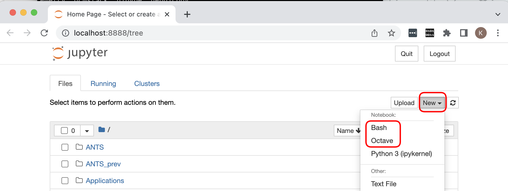
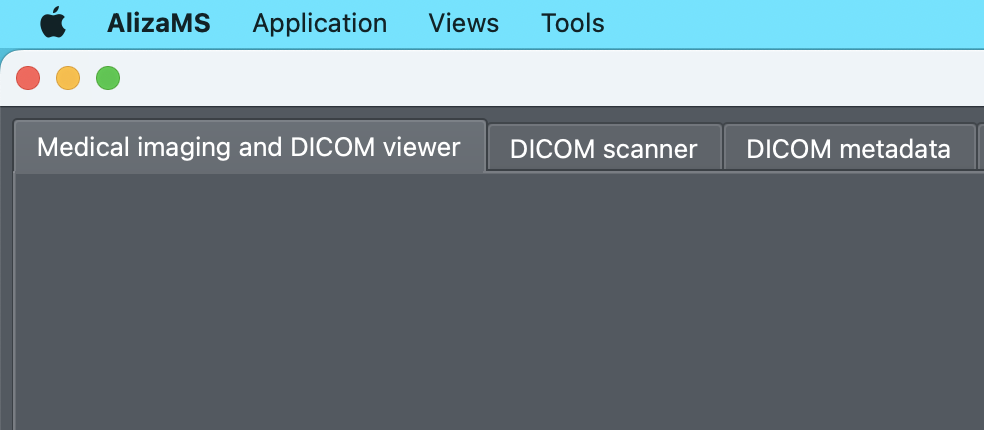

# macOS native 環境での ABiS チュートリアルの準備方法

- 本セクションでは、Lin4Neuro を使わずに、macOS native 環境でのチュートリアルのセットアップ方法を記載します。Apple M1/M2 でも対応可能です。ただし、この方法でのセットアップのサポートは限られることをご了承ください(個人個人で環境がかなり異なるためです)。このインストラクションを読んでわからないことが多い方は、ご自身でのセットアップは難しいとお考えいただき、Lin4Neuroでの受講としてください

## 前提条件

- CPUは Intel でも Apple M1/M2 でも問いません
- ターミナルはデフォルトの zsh でなく bash を使用することとします。ターミナルから以下のようにタイプしてください

    ```
    echo $SHELL
    ```

- この結果が、/bin/bash でない方は、以下のコマンドをタイプしてください

    ```
    chsh -s /bin/bash
    ```

- この後、ターミナルを起動し直すと、bashに変わります。確認のためには、`echo $SHELL` を実行し、その結果が /bin/bash であることを確認してください。

## インストールが必要なソフトウェア
- git
- octave
- python3
- Jupyter Notebook (bashとoctaveカーネル含む)
- Heudiconv
- AlizaMS
- MRIcroGL
- XQuartz
- FSL
- MRtrix3
- 3D Slicer
- FreeSurfer
- Matlab
- SPM
- CONN


### 1. git

#### 1.1. インストール
- Command line tools for Xcode のインストールにより git を使うことが可能となります

    ```
    xcode-select --install
    ```

#### 1.2. 確認
- ターミナルから以下をタイプしていただき、バージョンが出力されれば大丈夫です

    ```
    git --version
    ```

### 2. Octave

#### 2.1. インストール
- Homebrew 経由でインストールするのが簡単です。Homebrew自体のインストールは、https://brew.sh/index_ja をご覧ください

    ```
    brew install octave
    ```

#### 2.2. 確認
- ターミナルから以下をタイプします

    ```
    octave --version
    ```

- GNU Octave, version 7.2.0 と表示されればOKです(バージョンは重要ではありませんので、古くても大丈夫です)

### 3. Python3

#### 3.1. インストール
- PythonもHomebrewで入れるのが簡単です。

    ```
    brew install python3
    ```

#### 3.2. 確認
- ターミナルを起動し、以下をタイプしてください。Python 3.10.8 以降であれば大丈夫です

    ```
    python3 --version
    ```

### 4. Jupyter Notebook および bash と octave のカーネル

#### 4.1. インストール
- Pythonをインストールした後、以下を実行してください

    ```
    pip3 install jupyter notebook
    pip3 install bash_kernel
    python3 -m bash_kernel.install
    pip3 install octave_kernel
    ```

#### 4.2. 確認
- ターミナルから以下をタイプしてください

    ```
    jupyter-notebook
    ```

- WebブラウザにJupyterという画面が出ることを確認してください。さらに、右側の"New"を押して、"octave" "bash" というメニューがあることを確認してください。ページを消した後、Jupyter Notebookを起動したターミナルで、control + c を押すとJupyter Notebookのサーバーをシャットダウンできますので y を押してシャットダウンしてください

    

### 5. Heudiconv

#### 5.1. インストール

- ターミナルから以下をタイプしてください

    ```
    pip3 install heudiconv
    ```

#### 5.2. 確認

- ターミナルから以下をタイプしてください。0.11.6と出力されればOKです

    ```
    heudiconv --version
    ```

### 6. AlizaMS

#### 6.1. インストール
- 以下のリンクからインストーラーを入手できます
- https://github.com/AlizaMedicalImaging/AlizaMS/releases/download/v1.8.3/AlizaMS-1.8.3.dmg

#### 6.2. 確認
- アプリケーションから AlizaMS を起動し、以下の画面が出れば大丈夫です

    

#### 6.3. 画面の設定(任意)
- 見た目をmacOSに統一させます。上のメニューバーから、AlizaMS -> Preferences を選んだのち、"Application" を選びます。Themeを macOS とします

    

### 7. MRIcroGL

#### 7.1. インストール
- MRIcroGL は以下のリンクからインストーラーを入手できます
- https://github.com/rordenlab/MRIcroGL/releases/download/v1.2.20220720/MRIcroGL_macOS.dmg
- インストール後、以下のコマンドを実行し、.bash_profileに設定を書き込みます

    ```
    echo '' >> ~/.bash_profile
    echo '#MRIcroGL' >> ~/.bash_profile
    echo 'PATH=$PATH:/Applications/MRIcroGL.app/Contents/Resources' >> ~/.bash_profile
    ```

#### 7.2. 確認
- 一度ターミナルを終了し、ターミナルを再度起動した後に、以下をタイプしてください

    ```
    dcm2niix --version
    ```

この結果が、v1.0.20220720 と表示されれば大丈夫です

### 8. XQuartz
- XQuartz は FSL の実行のために必要です

#### 8.1. インストール
- Homebrewが便利です

    ```
    brew install --cask xquartz
    ```

#### 8.2. 確認
- FSLが実行されればXQuartzもきちんとインストールされるのでここでは確認しません

### 9. FSL
#### 9.1. インストール
- 以下をターミナルから実行し、fslinstaller.pyを入手し、実行します。古いバージョンの fslinstaller.py は python3 に対応していないので、新しいバージョンを必ず入手してください

    ```
    cd ~/Downloads
    curl -O https://fsl.fmrib.ox.ac.uk/fsldownloads/fslinstaller.py
    python3 fslinstaller.py 
    ```

- インストール完了後、FSLの設定は .profile に記載されます。これが終わったら一度ターミナルを終了し、再びターミナルを起動します

#### 9.2. 確認
- ターミナルから以下をタイプします

    ```
    fsl
    ```

- これでFSLが立ち上がればOKです

    

### 10. MRtrix3
#### 10.1. インストール
- ターミナルから以下を実行します

    ```
    sudo bash -c "$(curl -fsSL https://raw.githubusercontent.com/MRtrix3/macos-installer/master/install)"
    ```

#### 10.2. 確認
- ターミナルから以下を実行します

    ```
    mrview
    ```

- MRViewが起動すれば大丈夫です

### 11. 3D Slicer

#### 11.1. インストール
- 本家サイトのネットワークが非常に重いので、別の場所にインストーラーを置きました。以下のリンクからダウンロードしてください
- https://www.nemotos.net/l4n-abis/Slicer-5.0.3-macosx-amd64.dmg
- ダウンロードしたら他のソフトと同じようにインストールします

#### 11.2. 確認
- インストール後、3D Slicerを起動します

### 12. FreeSurfer

#### 12.1. インストール

- 以下でFreeSurfer 7.3.2のセットアップスクリプトが手に入ります。

    ```
    cd ~/Downloads
    curl -O https://gitlab.com/kytk/fs-scripts/-/raw/master/fs_setup_7.3.2_mac.sh
    bash fs_setup_7.3.2_mac.sh
    ```

- チュートリアルで使うスクリプト集も手に入れます。ホームディレクトリの下に git フォルダを作成し、その下に入手します。

    ```
    [ ! -d ~/git ] && mkdir ~/git
    cd git
    git clone https://gitlab.com/kytk/fs-scripts.git
    ```

- パスを設定します

    ```
    cd fs-scripts
    bash addpath.sh
    ```

- こうすると、以下のように質問されます。

    ```
    Which OS are you using? Select number.
    1) Linux
    2) MacOS
    3) quit 
    ```

- 2と入力し、Enterを押すと、パスが設定されます。

#### 12.2. 確認

- ターミナルを新しく立ち上げた上で以下のコマンドをタイプしてください

    ```
    fs_check_install.sh
    ```

- Freeviewが起動します。

#### 12.3. 海馬解析のためのMCRをインストール

- さらに、海馬解析のためのMCRをインストールします

    ```
    fs7_fl_mcr2019b.sh
    ```


### 13. Matlab
- Matlabは各自購入してください。Baseだけで大丈夫です。必要なバージョンは以下のリンクが参考になります
- https://jp.mathworks.com/support/requirements/previous-releases.html

### 14. SPM
#### 14.1. インストール
- GitHub経由が便利です
- ホームディレクトリの下に spm12 をインストールすることとします

    ```
    cd ~
    git clone https://github.com/spm/spm12.git
    ```

- さらにターミナルから以下を実行します

    ```
    sudo xattr -r -d com.apple.quarantine ~/spm12
    sudo find ~/spm12 -name '*.mexmaci64' -exec spctl --add {} \;
    ```

- この後、Matlabのパス設定で、~/spm12 を指定してください

#### 14.2. 確認
- Matlab から

    ```
    spm
    ```

とタイプし、SPMが起動すればOKです

### 15. CONN
#### 15.1. インストール
- CONNは **21.a** を使用します
- インストール方法は以下のリンクを参照してください
- https://www.nemotos.net/?p=3873

#### 15.2. 確認
- Matlabから

    ```
    conn
    ```

とタイプし、CONNが起動すればOKです

