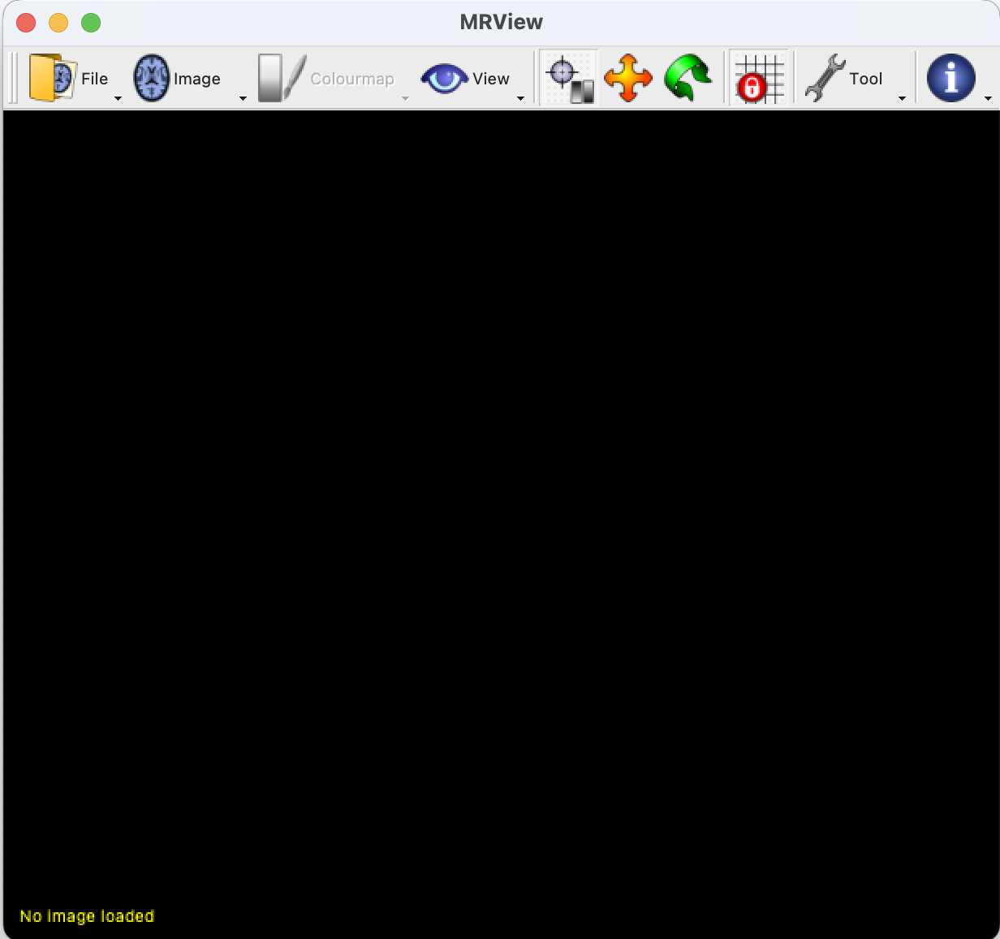
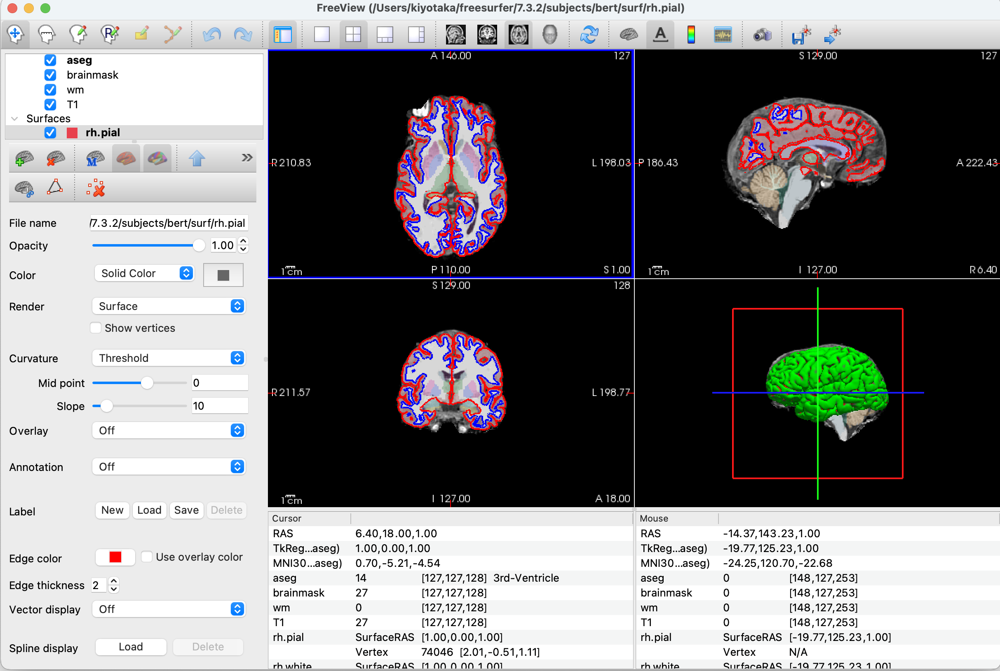
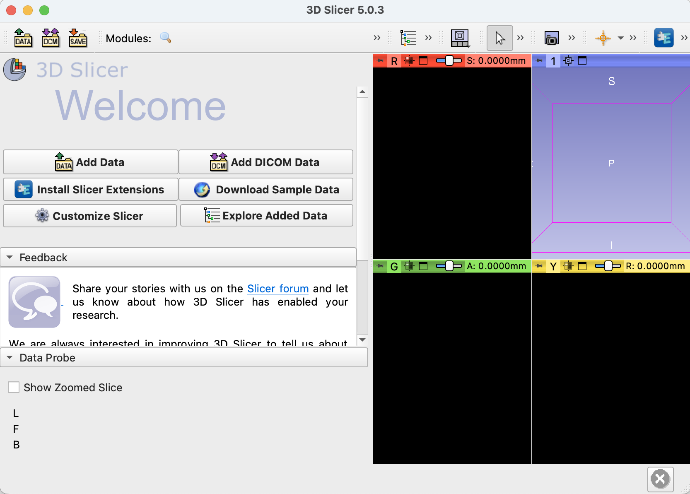

# macOS native 環境での ABiS チュートリアルの準備方法
 
## 目次

- [はじめに](#anchor0)
- [前提条件](#anchor1)
- [インストールが必要なソフトウェア](#anchor2)
- [ソフトウェア毎のインストールおよび確認方法](#anchor3)
- [一括インストールスクリプト](#anchor4)
- [問い合わせ](#anchor5)

<a id="anchor0"></a>
## はじめに

- **チュートリアルの準備には、約4-5時間必要となります。時間に十分に余裕をもって>準備をされてください。特に、macOS native環境では、想定通りにうまくいかないことも十分考えられます。このため、早めの準備をお願いします。なお、準備が終わった方にのみ当日のSlackのリンクが表示されますので、必ず準備を行ってください。準備なしの参加はできません**

- 本セクションでは、Lin4Neuro を使わずに、macOS native 環境でのチュートリアルのセットアップ方法を記載します。Apple M1/M2 でも対応可能です。ただし、この方法でのセットアップのサポートは限られることをご了承ください(個人個人で環境がかなり異なるためです)。このインストラクションを読んでわからないことが多い方は、ご自身でのセットアップは難しいとお考えいただき、Lin4Neuroでの受講としてください

- チュートリアルに十分な環境で参加していただくために、下記を参照のうえ、受講環境を整えてください。その後、https://kytk.github.io/abis-web-202212/ に戻っていただき、「チュートリアルテキストの入手」に進んでください

- データを入手し、受講のためのスクリプトを実行し、その値が正しい場合に限り、当日のSlackのアドレスをお伝えします。**2022年12月4日までに**必ずテスト解析まで終わらせてください。テストスクリプトを実行できた方が受講できます。セットアップがうまくいかない方はサポートしますので、早めにご連絡ください。サポート窓口は、このページの一番下にあります。

<a id="anchor1"></a>
## 前提条件

- CPUは Intel でも Apple M1/M2 でも問いません
- ターミナルはデフォルトの zsh でなく bash を使用することとします。ターミナルから以下のようにタイプしてください。

    ```
    echo $SHELL
    ```

- この結果が、/bin/bash (もしくは/usr/local/bin/bash) でない方は、以下のコマンドをタイプしてください

    ```
    chsh -s /bin/bash
    ```

- この後、ターミナルを起動し直すと、bashに変わります。確認のためには、`echo $SHELL` を実行し、その結果が /bin/bash であることを確認してください

- この場合、システムレベルの /etc/zshrc (キーバインディング等) や、~/.zshrc.profile にて個人的に設定している内容は反映されなくなるので注意してください

- zsh に戻したい場合は、いつでも `chsh -s /bin/zsh` で zsh に戻すことができます

<a id="anchor2"></a>
## インストールが必要なソフトウェア
- git
- octave
- python3
- Jupyter Notebook (bashとoctaveカーネル含む)
- AlizaMS
- MRIcroGL
- Heudiconv
- Pydicom
- tree
- XQuartz
- FSL
- MRtrix3
- ANTs
- FreeSurfer
- 3D Slicer
- Matlab
- SPM
- CONN

<a id="anchor3"></a>
## ソフトウェア毎のインストールおよび確認方法

### 1. git (バージョン指定なし)

#### 1.1. インストール
- Command line tools for Xcode のインストールにより git を使うことが可能となります

    ```
    xcode-select --install
    ```

#### 1.2. 確認
- ターミナルから以下をタイプしていただき、バージョンが出力されれば大丈夫です

    ```
    git --version
    ```

### 2. Octave (バージョン指定なし)

#### 2.1. インストール
- Homebrew 経由でインストールするのが簡単です。Homebrew自体のインストールは、https://brew.sh/index_ja をご覧ください

    ```
    brew install octave
    ```

#### 2.2. 確認
- ターミナルから以下をタイプします

    ```
    octave --version
    ```

- GNU Octave, version 7.2.0 と表示されればOKです(バージョンは重要ではありませんので、古くても大丈夫です)

### 3. Python3 (3.10.8以降)

#### 3.1. インストール
- PythonもHomebrewで入れるのが簡単です。

    ```
    brew install python3
    ```

#### 3.2. 確認
- ターミナルを起動し、以下をタイプしてください。Python 3.10.8 以降であれば大丈夫です

    ```
    python3 --version
    ```

#### 3.3 python の確認
- Monterey から python3 にはパスが通っても python にパスが通っていないことがありえます。これはMRtrix3 でエラーになりますので、確認します。
- ターミナルから以下をタイプしてください

    ```
    which python
    ```

- これで何も出力が帰ってこない場合、以下をタイプしてください

    ```
    sudo ln -s -f /usr/local/bin/python3 /usr/local/bin/python
    ```

- この上で改めて以下をタイプしてください

    ```
    which python
    ```

- 今度は、`/usr/local/bin/python` と出力されるはずです


### 4. Jupyter Notebook および bash と octave のカーネル (バージョン指定なし)

#### 4.1. インストール
- Pythonをインストールした後、以下を実行してください

    ```
    pip3 install jupyter notebook
    pip3 install bash_kernel
    python3 -m bash_kernel.install
    pip3 install octave_kernel
    ```

#### 4.2. 確認
- ターミナルから以下をタイプしてください

    ```
    jupyter-notebook
    ```

- WebブラウザにJupyterという画面が出ることを確認してください。さらに、右側の"New"を押して、"octave" "bash" というメニューがあることを確認してください。ページを消した後、Jupyter Notebookを起動したターミナルで、control + c を押すとJupyter Notebookのサーバーをシャットダウンできますので y を押してシャットダウンしてください

    


### 5. AlizaMS (バージョン指定なし)

#### 5.1. インストール
- 以下のリンクからインストーラーを入手できます
- https://github.com/AlizaMedicalImaging/AlizaMS/releases/download/v1.8.3/AlizaMS-1.8.3.dmg

#### 5.2. 確認
- アプリケーションから AlizaMS を起動し、以下の画面が出れば大丈夫です

    

#### 5.3. 画面の設定(任意)
- 見た目をmacOSに統一させます。上のメニューバーから、AlizaMS -> Preferences を選んだのち、"Application" を選びます。Themeを macOS とします

    


### 6. MRIcroGL (v1.2.20220720)

#### 6.1. インストール
- MRIcroGL は以下のリンクからインストーラーを入手できます
- https://github.com/rordenlab/MRIcroGL/releases/download/v1.2.20220720/MRIcroGL_macOS.dmg
- インストール後、以下のコマンドを実行し、.bash_profileに設定を書き込みます

    ```
    echo '' >> ~/.bash_profile
    echo '#MRIcroGL' >> ~/.bash_profile
    echo 'PATH=$PATH:/Applications/MRIcroGL.app/Contents/Resources' >> ~/.bash_profile
    ```

#### 6.2. 確認
- 一度ターミナルを終了し、ターミナルを再度起動した後に、以下をタイプしてください

    ```
    dcm2niix --version
    ```

この結果が、v1.0.20220720 と表示されれば大丈夫です


### 7. Heudiconv (バージョン指定なし)

#### 7.1. インストール

- ターミナルから以下をタイプしてください

    ```
    pip3 install heudiconv
    ```

#### 7.2. 確認

- ターミナルから以下をタイプしてください。0.11.6と出力されればOKです

    ```
    heudiconv --version
    ```

### 8. PyDicom (バージョン指定なし)

#### 8.1. インストール

- ターミナルから以下をタイプしてください

    ```
    pip3 install pydicom
    ```


### 9. tree (バージョン指定なし)

#### 9.1. インストール
- tree は、ディレクトリ構造を表示するプログラムです
- Homebrewで簡単にインストールできます
- ターミナルから以下をタイプしてください

    ```
    brew install tree
    ```

#### 9.2. 確認
- ターミナルから以下をタイプしてください

    ```
    tree -d -L 2
    ```

- ご自身がいるディレクトリの下にあるサブディレクトリが2階層まで表示されます


### 10. XQuartz (2.8.2)
- XQuartz は FSL の実行のために必要です

#### 10.1. インストール
- Homebrewが便利です

    ```
    brew install --cask xquartz
    ```

#### 10.2. 確認
- FSLが実行されればXQuartzもきちんとインストールされるのでここでは確認しません


### 11. FSL (6.0.5.2)
#### 11.1. インストール
- 以下をターミナルから実行し、fslinstaller.pyを入手し、実行します。古いバージョンの fslinstaller.py は python3 に対応していないので、新しいバージョンを必ず入手してください

    ```
    cd ~/Downloads
    curl -O https://fsl.fmrib.ox.ac.uk/fsldownloads/fslinstaller.py
    python3 fslinstaller.py 
    ```

- インストール完了後、FSLの設定は .profile に記載されます。これが終わったら一度ターミナルを終了し、再びターミナルを起動します

#### 11.2. 確認
- ターミナルから以下をタイプします

    ```
    fsl
    ```

- これでFSLが立ち上がればOKです

    

### 12. MRtrix3 (バージョン指定なし)
#### 12.1. インストール
- ターミナルから以下を実行します

    ```
    sudo bash -c "$(curl -fsSL https://raw.githubusercontent.com/MRtrix3/macos-installer/master/install)"
    ```

#### 12.2. 確認
- ターミナルから以下を実行します

    ```
    mrview
    ```

- MRViewが起動すれば大丈夫です

    


### 13. ANTs (バージョン指定なし)
#### 13.1. インストール
- ターミナルから以下を実行します

```
cd ~/Downloads
curl -O https://gitlab.com/kytk/shell-scripts/-/raw/master/ANTs_installer_macOS.sh
bash ANTs_installer_macOS.sh
```

#### 13.2. 確認
- "ANTs is installed" "Please close and re-run the terminal to reflect PATH setting" と出たら、ターミナルを一度閉じて、再度ターミナルを開きます

- ターミナルから以下を実行します

```
ANTS
```

- "call ANTS or ANTS --help" と出れば大丈夫です


### 14. FreeSurfer (7.3.2)

#### 14.1. license.txt の入手
- まだFreeSurferのライセンスをお持ちでない方は、https://surfer.nmr.mgh.harvard.edu/registration.html にアクセスし、必要事項を入力してください。license.txt を添付したメールがご自身のメールアドレスに送られてきますので、その license.txt を、ダウンロード フォルダにコピーしてください

#### 14.2. インストール

- 以下でFreeSurfer 7.3.2のセットアップスクリプトを入手し、インストールを実行します。

    ```
    cd ~/Downloads
    curl -O https://gitlab.com/kytk/fs-scripts/-/raw/master/fs_setup_7.3.2_mac.sh
    bash fs_setup_7.3.2_mac.sh
    ```

- チュートリアルで使うスクリプト集も手に入れます。ホームディレクトリの下に git フォルダを作成し、その下に入手します。

    ```
    [ ! -d ~/git ] && mkdir ~/git
    cd ~/git
    git clone https://gitlab.com/kytk/fs-scripts.git
    ```

- パスを設定します

    ```
    cd fs-scripts
    bash addpath.sh
    ```

- こうすると、以下のように質問されます。

    ```
    Which OS are you using? Select number.
    1) Linux
    2) MacOS
    3) quit 
    ```

- 2と入力し、Enterを押すと、パスが設定されます。

#### 14.3. 確認

- ターミナルを新しく立ち上げた上で以下のコマンドをタイプしてください

    ```
    fs_check_install.sh
    ```

- Freeviewが起動します。

    

#### 14.4. 海馬解析のためのMCRをインストール

- さらに、海馬解析のためのMCRをインストールします

    ```
    fs7_dl_mcr2019b.sh
    ```

- 30分くらいかかると思いますがインストールされます


### 15. 3D Slicer (5.0.3)

#### 15.1. インストール
- 本家サイトのネットワークが非常に重いので、別の場所にインストーラーを置きました。以下のリンクからダウンロードしてください
- https://www.nemotos.net/l4n-abis/macOS/Slicer-5.0.3-macosx-amd64.dmg
- ダウンロードしたら他のソフトと同じようにインストールします

#### 15.2. 確認
- インストール後、3D Slicerを起動します

    

### 16. SPM12 と CONN21.a : Matlab をお持ちの場合
- SPM と CONN はMatlabを持っているか持っていないかでインストールの方法が変わります。Matlab をお持ちでない方は、次の 16. SPM と CONN: Matlab をお持ちでない場合 に従ってセットアップをしてください

- Apple M1/M2 は、Matlab R2020b 以降でないと動作しませんのでご注意ください

#### 16.1. SPM12のインストール
- GitHub経由が便利です
- ホームディレクトリの下に spm12 をインストールすることとします

    ```
    cd #ホームディレクトリに移動します
    git clone https://github.com/spm/spm12.git
    ```

- SPMはmacOSのセキュリティで実行できないことがあるため、この問題を回避するために、ターミナルから以下を実行します

    ```
    sudo xattr -r -d com.apple.quarantine ~/spm12
    sudo find ~/spm12 -name '*.mexmaci64' -exec spctl --add {} \;
    ```

- この後、Matlabのパス設定で、/Users/ご自分のユーザ名/spm12 を指定してください

#### 16.2. SPM12の確認
- Matlab から

    ```
    spm
    ```

とタイプし、SPMが起動すればOKです

#### 16.3. CONN 21.a のインストール
- 異なるバージョンを使うことができるように、ホームディレクトリの下に conn を作成し、その下に、conn21a をインストールすることにします

- ターミナルで以下をタイプします

    ```
    cd ~/Downloads
    curl -O https://www.nitrc.org/frs/download.php/12426/conn21a.zip
    mkdir conn21a
    unzip conn21a.zip -d conn21a
    cd conn21a
    mv conn conn21a
    [ ! -d ~/conn ] && mkdir ~/conn
    cp -r conn21a ~/conn
    ```

- その後、Matlab のパス設定で、/Users/ご自分のユーザ名/conn/conn21a を指定してください

#### 16.3. CONN 21.a の確認
- Matlabから

    ```
    conn
    ```

とタイプし、CONNが起動すればOKです


### 17. SPM12 と CONN21.a : Matlab をお持ちでない場合

- チュートリアル用に SPM12 と CONN21.a を Matlab がなくても動作するようにスタンドアロン版を作成しました。以下に従ってセットアップを行ってください

#### 17.1. Matlab Runtime R2020b の入手

- ターミナルに以下を入力し、Matlab Runtime R2020b を入手します。Intel Mac, Apple M1 ともに共通です。

    ```
    cd ~/Downloads
    curl -O https://ssd.mathworks.com/supportfiles/downloads/R2020b/Release/8/deployment_files/installer/complete/maci64/MATLAB_Runtime_R2020b_Update_8_maci64.dmg.zip
    unzip MATLAB_Runtime_R2020b_Update_8_maci64.dmg.zip
    ```

- ダウンロードフォルダにある MATLAB_Runtime_R2020b_Update_8_maci64.dmg をダブルクリックします

- InstallForMacOSX をダブルクリックします。**インストール先はデフォルトのまま変更しないでください**

#### 17.2. SPM12 standalone のインストール

- 以下で SPM12 standalone を入手し、/opt の下にインストールします。

    ```
    cd ~/Downloads
    curl -O https://www.nemotos.net/l4n-abis/macOS/spm12_standalone_maci64_v99.zip
    sudo unzip spm12_standalone_maci64_v99.zip -d /opt/
    echo "" >> ~/.bash_profile
    echo "# Alias for SPM12" >> ~/.bash_profile
    echo "alias spm='/opt/spm12_standalone/run_spm12.sh /Applications/MATLAB/MATLAB_Runtime/v99'" >> ~/.bash_profile
    ```

- 一度ターミナルを閉じます。

#### 17.3. SPM12 standalone の確認

- ターミナルを起動した後、spm と入力すればSPMが起動します。ただ、初回は起動するまでに数分時間がかかるため、焦らずにお待ちください


    ```
    spm
    ```

#### 17.4. CONN 21.a standalone のインストール

- CONN は以下の方法でインストールできます

    ```
    cd ~/Downloads
    curl -O https://www.nemotos.net/l4n-abis/macOS/conn21a_standalone_maci64_v99.zip
    unzip conn21a_standalone_maci64_v99.zip -d /Applications/
    echo "" >> ~/.bash_profile
    echo "# Alias for CONN 21.a" >> ~/.bash_profile
    echo "alias conn='/Applications/conn21a_standalone/run_conn.sh /Applications/MATLAB/MATLAB_Runtime/v99'" >> ~/.bash_profile
    ```

- ターミナルを一度終了します

#### 17.5. CONN 21.a standalone の確認

- GUIとコマンドラインのどちらからも起動できます

- GUI の場合は、アプリケーションの中にある conn21a_standalone の中の conn をダブルクリックしてください

- ターミナルの場合は、ターミナルから conn とタイプすれば起動します

    ```
    conn
    ```


<a id="anchor4"></a>
## 一括インストールスクリプト
- 以上で示した作業を半自動で行うスクリプトを準備しました
- FreeSurferのライセンスだけ、https://surfer.nmr.mgh.harvard.edu/registration.html にアクセスして事前に入手し、ダウンロードフォルダに保存してください
- 途中、何度もパスワードを聞かれますので、適宜進捗状況をご確認ください
- インストール後、上記の個別のソフトウェアのセットアップを参照いただき、それぞれのソフトウェアが正しくインストールされたかご確認ください
- ターミナルから以下を実行してください

    ```
    cd ~/Downloads
    curl -O https://raw.githubusercontent.com/kytk/abis-web-202212/main/setup_macnative.sh
    bash setup_macnative.sh
    ```

- ただし、これは個人の環境によって大きな差があるので、ご自身で解決できる方のみ使用されてください。初心者の方は、上の指示に従ってひとつずつインストールしてください

<a id="anchor5"></a>

## 問い合わせ

- 準備がうまくいかない時のために、問い合わせフォームを準備しています。こちらから
ご質問ください。数日以内に担当者から返信させていただきます

- [問い合わせフォーム](https://forms.gle/NNCjrKn4uQJeYKdg6){:target="_blank"} 

